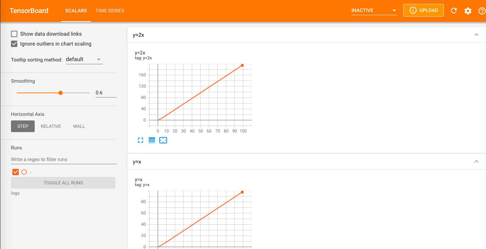
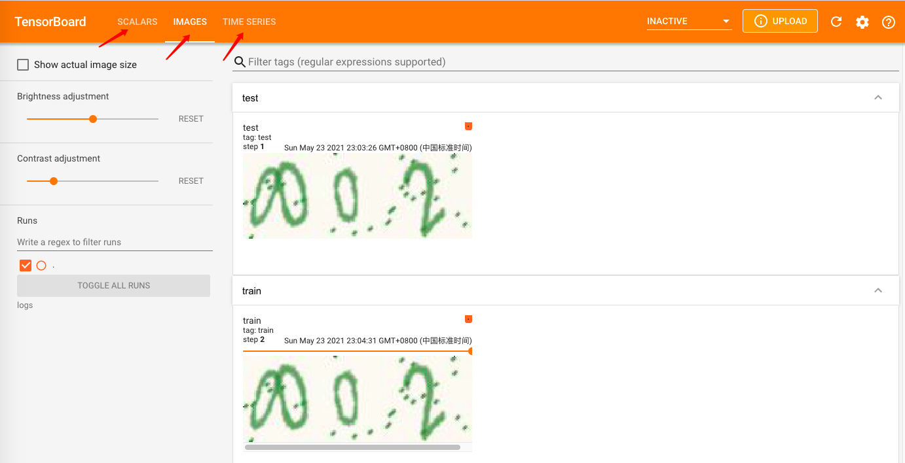

###### conda中创建py3.6的环境，命名为pytorch
```
conda create -n pytorch python=3.6
```

进入命名为pytorch的conda环境
```
source activate
conda activate pytorch 
```

###### 安装torch
```
pip --default-timeout=1000 install torch
```
###### 安装tensorboard
```
pip install --default-timeout=1000 tensorboard
```

#### 使用tensorboard
1、创建生成tensorboard图的demo
```
from torch.utils.tensorboard import SummaryWriter

writer = SummaryWriter("logs")

for i in range(100):
    writer.add_scalar("y=x", i, i)

writer.close()

```

2、使用命令运行生成的tfevents

默认使用6006端口

`tensorboard --logdir=logs`

或者指定端口运行

`tensorboard --logdir=logs --port=6007`

```
(pytorch) ➜  pwd                                           
/Users/mobvoi/workspace/sourceTree/mdl/python/pytorch/learn_pytorch_01

(pytorch) ➜  tensorboard --logdir=logs
TensorFlow installation not found - running with reduced feature set.

NOTE: Using experimental fast data loading logic. To disable, pass
    "--load_fast=false" and report issues on GitHub. More details:
    https://github.com/tensorflow/tensorboard/issues/4784

Serving TensorBoard on localhost; to expose to the network, use a proxy or pass --bind_all
TensorBoard 2.5.0 at http://localhost:6006/ (Press CTRL+C to quit)

```

注意：
1、要进入当前项目根目录（learn_pytorch_01）下执行tfevents的运行脚本；
2、如果多次调整后运行出来的图形有出现交叉的，官方建议将logs文件夹下的tfevents删除，然后重新启动运行6006端口；

添加坐标



添加图片



