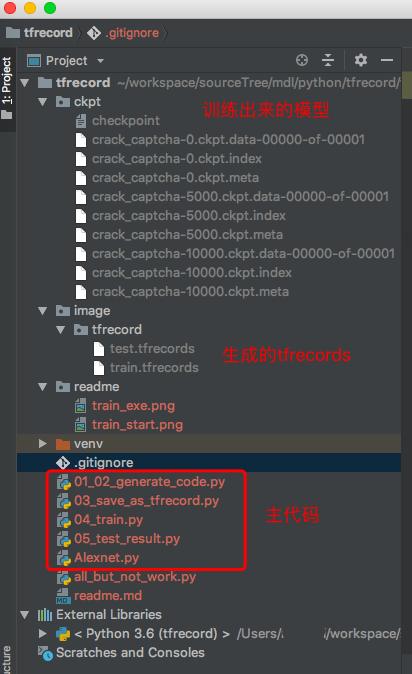
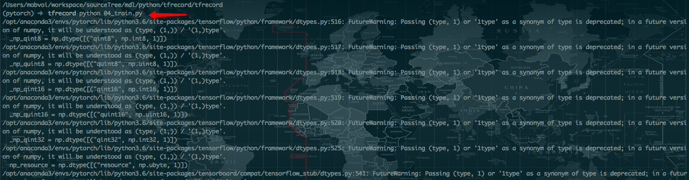
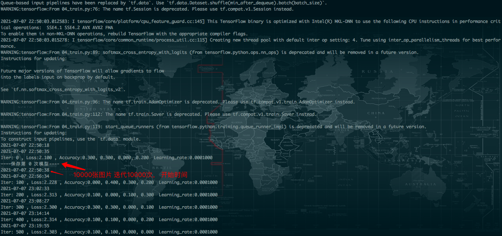
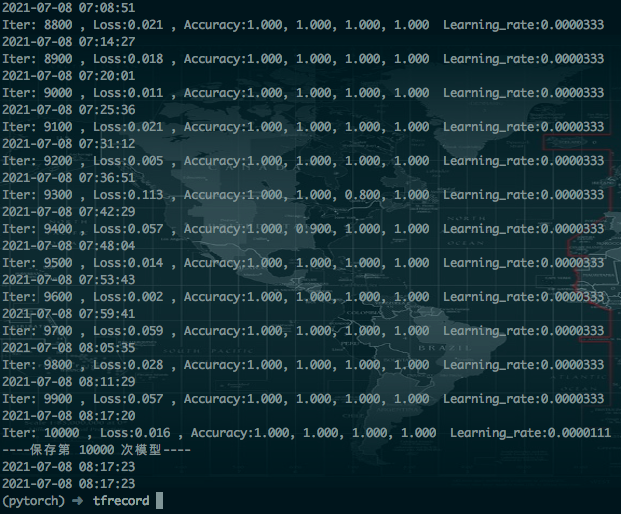

代码来源：https://blog.csdn.net/weixin_40479663/article/details/83383233

注意点：
   1、文章中使用的 `train_network_fn = nets_factory.get_network_fn('alexnet_v2', num_classes=CHAR_NUM, \
                                             weight_decay=0.0005,is_training=True)`
   改为`train_network_fn = Network(num_classes=CHAR_NUM,weight_decay=0.0005, is_training=True)`
   
   `Network`来自于python文件`Alexnet.py`
   
   2、项目使用的tensorflow不能使用2.x版本，目前使用的是1.14.0版本
   `conda install tensorflow==1.14.0`
   
   3、导出requirements.txt的命令`pip3 freeze > requirements.txt`
   
   4、安装导出requirements.txt中库的命令`pip3 install -r requirements.txt`
   
   5、`all_but_not_work.py`文件是集成其他01-05文件的所有代码，是准备在谷歌实验室使用的（https://colab.research.google.com/）可忽略；
   
   6、项目中目前只针对通过ImageCaptcha生成的0-9的10个数字的验证码进行训练，所以用的是int类型的值接收的label0-label4的值，如果需要识别数字，
   可以更改类型（尝试过，失败了，可能还是有地方没搞清楚）或者将label的值改成ASCII码都识别成数值进行训练，然后使用模型识别的时候再将ASCII转为字符（理论上好似可行的，正在尝试中）；
   将`03_save_as_tfrecord.py`中的`num_labels.append(int(labels[j]))` 改为 `num_labels.append(ord(labels[j]))`
   
   
工程结构：

训练通过ImageCaptcha生成的0-9的10个数字的验证码的过程，生成了10000张验证码，用mac-air训练时长长达9个小时

执行

开始

结束

